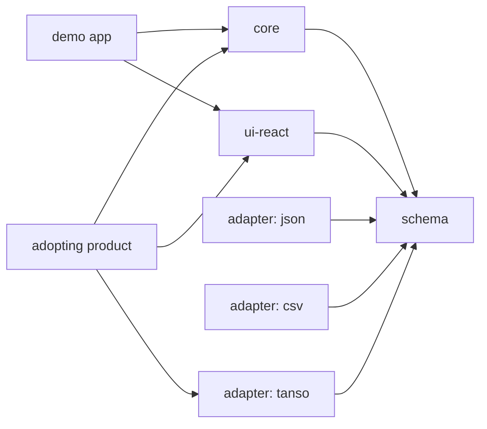
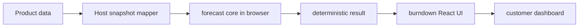
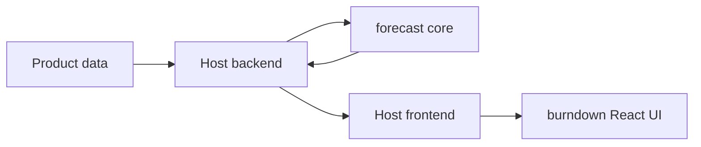
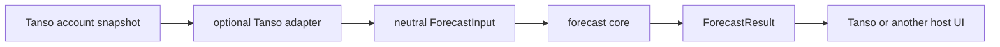

# Credit Burndown Forecaster Architecture

## Status

This document defines the target architecture and implemented primary MVP.
Schema, core, React UI, and JSON/CSV adapters exist. The demo and
product-specific adapters remain deferred.

The product is an embeddable, customer-facing credit usage forecaster. A SaaS
company supplies a read-only account snapshot. The estimator calculates
low/base/high burndown projections. A neutral React package renders those
results inside the company's dashboard.

This is not a pricing-design system. It does not recommend credit weights,
packages, margins, prices, or runtime billing rules.

Related documents:

- [Product scope](product-scope.md)
- [Forecast methodology](methodology.md)
- [Optional Tanso integration](tanso-integration.md)
- [ADR-001: Provider-neutral forecast core](architecture/decisions/ADR-001-provider-neutral-core.md)
- [ADR-002: Result-controlled React UI](architecture/decisions/ADR-002-injected-react-ui.md)

## Principles

1. The adopting product is the source of truth.
2. The estimator receives an immutable snapshot and returns an immutable
   forecast.
3. The core is deterministic, offline, decimal-safe, and side-effect free.
4. The core never fetches, stores, grants, deducts, or bills credits.
5. The UI renders neutral input and core output. It contains no forecast
   formulas.
6. Tanso is one optional adapter, not the architecture.
7. Identical inputs produce structurally identical outputs.
8. Dates and versions come from the host. The system clock is not an input.

## Ownership

| Capability | Estimator | Adopting product |
|---|---:|---:|
| Validate a neutral forecast snapshot | Owns | Supplies snapshot |
| Calculate observed usage and baseline burn | Owns | Supplies daily usage |
| Calculate low/base/high projections | Owns | Chooses explicit multipliers |
| Calculate ending balance, utilization, depletion, and shortfall | Owns | Decides customer action |
| Produce warnings and calculation traces | Owns | Presents or records them |
| Render a neutral embeddable burndown UI | Owns | Composes and themes it |
| Source-of-truth balance and allocation | Reads snapshot | Owns |
| Usage-event collection and daily aggregation | Does not own | Owns |
| Wallet grants, deductions, reversals, rollover, and expiration | Does not own | Owns |
| Authentication, authorization, storage, and refresh | Does not own | Owns |
| Subscription, entitlement, payments, and top-ups | Does not own | Owns |
| CTA behavior after a warning | Exposes slot only | Owns |

The estimator must never attempt to reconcile the supplied balance against
the supplied usage. A host may have rollover, adjustments, refunds, or other
wallet behavior that is intentionally outside the neutral contract.

## Target repository structure

```text
credit-estimator/
├── packages/
│   ├── schema/
│   ├── core/
│   ├── ui-react/
│   └── adapters/
│       ├── json/
│       ├── csv/
│       └── tanso/
├── apps/
│   └── demo/
├── docs/
└── fixtures/
```

Create packages only when implementation reaches them. Empty packages do not
prove the architecture.

## Package responsibilities

| Package | Proposed package name | Owns | Must not own |
|---|---|---|---|
| `packages/schema` | `@tansohq/credit-forecast-schema` | Versioned neutral input, result, warning, trace, and validation-error contracts | Formulas, I/O, React, product identifiers |
| `packages/core` | `@tansohq/credit-forecast-core` | Validation orchestration, decimal-safe forecast calculations, warnings, traces | Network, filesystem, credentials, React, adapters, product state |
| `packages/ui-react` | `@tansohq/credit-burndown-react` | Controlled, composable, accessible forecast presentation | Fetching, estimation, authentication, persistence, billing, formulas |
| `packages/adapters/json` | `@tansohq/credit-forecast-json` | Lossless neutral snapshot/result serialization | Forecast policy |
| `packages/adapters/csv` | `@tansohq/credit-forecast-csv` | Documented tabular import/export and mapping warnings | Hidden defaults, formulas |
| `packages/adapters/tanso` | To decide | Optional Tanso-to-neutral snapshot mapping | React, core policy, required credentials in neutral packages |
| `apps/demo` | Not published | Reference local calculation and widget composition | New domain behavior |

## Dependency direction



Forbidden dependencies:

- `core -> ui-react`;
- `core -> adapters/*`;
- `core -> product SDK`;
- `schema -> core`, React, adapters, or I/O;
- `ui-react -> core`, network client, product SDK, or adapter;
- `adapters/tanso -> ui-react`; and
- any neutral package -> Tanso credentials or UUIDs.

The deliberate `ui-react -> schema` dependency makes the widget a renderer of
an already calculated result. A host may run the core in the browser, on its
server, or in another compatible service without changing the UI contract.

## Neutral forecast contract

### Versions

Every input and result contains:

- `schemaVersion`: neutral payload shape and compatibility;
- `methodologyVersion`: formula, date, precision, and rounding semantics.

There is no `modelVersion`. Scenario multipliers are explicit input data, not
a published pricing model.

### Decimal representation

Portable JSON uses canonical base-10 strings for credit amounts,
multipliers, rates, utilization, and trace values. Count fields such as
`lookbackDays` use JSON integers.

Examples: `"0"`, `"1250"`, `"1.15"`, `"0.833333"`.

The schema rejects exponent notation, non-finite values, leading plus signs,
more than 12 fractional digits, and ambiguous formatting. Every named decimal
result uses the methodology's 12-place round-half-up rule. No calculation uses
binary floating-point arithmetic.

### Dates

All dates are explicit ISO date-only values (`YYYY-MM-DD`) with calendar-day
semantics:

- period: `[period.startDate, period.endDate)`;
- observed usage: `[period.startDate, asOf)`;
- projection: `[asOf, period.endDate)`.

`asOf` is the first projected date. The host supplies it. The core never reads
the system clock or timezone.

### Conceptual input

```ts
interface ForecastInput {
  schemaVersion: string;
  methodologyVersion: string;
  asOf: ISODate;
  period: {
    startDate: ISODate;
    endDate: ISODate;
    allocation: DecimalString;
    lowBalanceThreshold: DecimalString;
  };
  lookbackDays: number;
  dailyUsage: readonly {
    date: ISODate;
    creditsUsed: DecimalString;
  }[];
  balance: {
    current: DecimalString;
    schedule: readonly {
      date: ISODate;
      creditDelta: DecimalString;
      reason?: string;
    }[];
  };
  scenarios: readonly [
    { key: "low"; burnMultiplier: DecimalString },
    { key: "base"; burnMultiplier: "1" },
    { key: "high"; burnMultiplier: DecimalString },
  ];
  extensions?: NamespacedExtensions;
}
```

Validation requires:

- `period.startDate < asOf < period.endDate`;
- one daily usage row for every observed date, including zero-use days;
- ordered, unique daily usage dates;
- `lookbackDays` greater than zero and no greater than observed-day count;
- non-negative usage and low-balance threshold, positive allocation, and a
  valid signed current balance;
- exactly `low`, `base`, and `high` scenarios;
- base multiplier exactly `"1"` and `low < base < high`;
- scheduled deltas only inside the projected range; and
- scheduled deltas ordered by date, with multiple rows on one date summed
  before that day's burn.

Missing values fail validation. The core does not silently invent financial
or forecast inputs.

### Conceptual result

```ts
interface ForecastResult {
  schemaVersion: string;
  methodologyVersion: string;
  asOf: ISODate;
  daysRemaining: number;
  creditsUsedToDate: DecimalString;
  baselineDailyBurn: DecimalString;
  observedPoints: readonly {
    date: ISODate;
    creditsUsed: DecimalString;
    cumulativeCreditsUsed: DecimalString;
  }[];
  scenarios: readonly ScenarioForecast[];
  warnings: readonly ForecastWarning[];
  calculationTrace: CalculationTrace;
}

interface ScenarioForecast {
  key: "low" | "base" | "high";
  dailyBurn: DecimalString;
  projectedCreditsUsed: DecimalString;
  projectedPeriodConsumption: DecimalString;
  utilization: DecimalString;
  endingBalance: DecimalString;
  shortfall: DecimalString;
  depletionDate: ISODate | null;
  status: "ON_TRACK" | "LOW_BALANCE_PROJECTED" | "DEPLETION_PROJECTED";
  points: readonly {
    date: ISODate;
    startBalance: DecimalString;
    balanceDelta: DecimalString;
    creditsUsed: DecimalString;
    endingBalance: DecimalString;
  }[];
}
```

The schema may add explicit fields through a new `schemaVersion`. It must not
hide values required to reproduce the summary from chart points.

### Warnings

Warnings are structured and stable:

```ts
type ForecastWarning =
  | {
      code: "LOW_BALANCE_PROJECTED";
      scenarioKey: "low" | "base" | "high";
      endingBalance: DecimalString;
      threshold: DecimalString;
    }
  | {
      code: "DEPLETION_PROJECTED";
      scenarioKey: "low" | "base" | "high";
      depletionDate: ISODate;
      shortfall: DecimalString;
    };
```

Warnings explain valid forecasts. Invalid input produces structured
validation errors and no forecast.

### Calculation traces

Trace steps are ordered data, not executable expressions:

```ts
type TraceValue =
  | null
  | boolean
  | number
  | string
  | readonly TraceValue[]
  | { readonly [key: string]: TraceValue };

interface CalculationTrace {
  sourceInputs: readonly {
    path: string;
    value: TraceValue;
  }[];
  steps: readonly CalculationStep[];
}

interface CalculationStep {
  key: string;
  formula: string;
  operands: Readonly<Record<string, TraceValue>>;
  result: TraceValue;
}
```

Stable keys identify methodology steps. Human-readable formulas aid review.
Consumers must not re-evaluate the formula string.

## Deterministic calculation flow

The exact formulas and rounding rules live in
[methodology.md](methodology.md). The dependency flow is:

1. Validate versions, decimal strings, date ranges, complete history,
   scenarios, and scheduled deltas.
2. Sum all observed daily usage into `creditsUsedToDate`.
3. Sum the final `lookbackDays` observed buckets and divide by
   `lookbackDays` to obtain `baselineDailyBurn`.
4. Multiply baseline burn by each explicit scenario multiplier.
5. For every projected date, apply that date's scheduled credit delta before
   subtracting scenario burn.
6. Derive projected use, projected period consumption, allocation
   utilization, ending balance, first depletion date, shortfall, and status.
7. Emit observed points, projected points, warnings, and ordered traces from
   the same calculated values.

The core does not stop calculation when balance reaches zero. Negative final
balances make shortfall visible. The first date with an ending balance at or
below zero is the depletion date. A later scheduled addition does not erase
the earlier depletion date, warning, or `DEPLETION_PROJECTED` status.

## Host integration flows

### Local browser calculation



This is the default adoption path. It needs no estimator service.

### Host-side calculation



The host owns transport authentication, cancellation, retries, caching, and
freshness. HTTP metadata and timestamps stay outside the deterministic result.

### Optional Tanso mapping



Removing the Tanso adapter must not change schema, core, fixture, JSON/CSV, or
React package behavior.

## React UI contract

The generic widget receives a calculated result. It does not receive an API
client or an injected estimator function.

```tsx
const result = forecastCreditUsage(input);

<CreditBurndown.Root
  input={input}
  result={result}
  selectedScenario={selectedScenario}
  onSelectedScenarioChange={setSelectedScenario}
  messages={messages}
>
  <CreditBurndown.Summary />
  <CreditBurndown.Chart />
  <CreditBurndown.Scenarios />
  <CreditBurndown.Warnings />
  <CreditBurndown.Breakdown />
  <CreditBurndown.Actions>{hostActions}</CreditBurndown.Actions>
</CreditBurndown.Root>
```

Result control removes networking, stale-request, cancellation, and error
normalization from the component library. A remote host can still calculate
elsewhere and pass the same `ForecastResult`.

### Component responsibilities

- `Root`: context, selected-scenario control, consistency checks, layout hook.
- `Summary`: balance, usage-to-date, baseline burn, ending balance, depletion.
- `Chart`: observed usage and projected scenario data.
- `Scenarios`: keyboard-operable low/base/high selection and comparison.
- `Warnings`: semantic warning list with text labels.
- `Breakdown`: trace and daily values required to audit calculations.
- `Actions`: host-supplied content only. No built-in purchase or top-up action.

### UI quality contract

- React peer support begins at `^18.2 || ^19`, limited to versions exercised
  in CI.
- Package import is SSR-safe: no `window` or `document` access at module scope.
- CSS custom properties use `--credit-burndown-*`.
- Public class names use `credit-burndown-*`.
- Selectors remain low-specificity and no global reset ships.
- A typed `messages` map supplies neutral English defaults and host overrides.
- Layout responds to embedding-container width, not only viewport width.
- Scenario controls, trace disclosure, and actions are keyboard operable.
- Status is never conveyed by color alone.
- Every chart has a screen-reader summary and an accessible tabular fallback.
- Consumer tests cover narrow containers, zoom, reduced motion, high contrast,
  and forced colors.
- No formula is duplicated in a component or formatter.

## Adapter interfaces

Adapters transform data at the edge. The core never discovers or calls them.

### Snapshot import

```ts
interface ForecastInputImporter<Source> {
  readonly format: string;
  import(source: Source): ImportResult<ForecastInput>;
}

interface ImportResult<Value> {
  value?: Value;
  errors: readonly MappingIssue[];
  warnings: readonly MappingIssue[];
}
```

An importer may normalize column names or product fields. It may not invent a
missing balance, allocation, date, usage day, lookback, threshold, or
scenario multiplier.

### Result export

```ts
interface ForecastExporter<Artifact> {
  readonly format: string;
  export(request: {
    input: ForecastInput;
    result: ForecastResult;
  }): Artifact;
}
```

JSON export is lossless. CSV export declares its tables, delimiter, encoding,
header version, decimal representation, and any omitted nested data. Lossy
export emits a warning.

### Product snapshot adapter

```ts
interface ProductSnapshotAdapter<ProductSnapshot> {
  toForecastInput(snapshot: ProductSnapshot): ImportResult<ForecastInput>;
}
```

Product adapters map stable host fields into the neutral contract. Product
identifiers may be retained only in namespaced extensions. They are never
required by the core.

## Namespaced extensions

Portable inputs may carry optional metadata:

```json
{
  "extensions": {
    "com.example.product": {
      "accountReference": "customer-visible-reference"
    }
  }
}
```

- Namespaces should be collision-resistant.
- Unknown extensions are preserved by lossless adapters.
- The core never branches on extension content.
- Secrets and credentials are forbidden.
- A value that changes arithmetic belongs in the versioned neutral schema,
  not an extension.

## Optional hosted API

A generic API is a deployment choice, not an OSS runtime dependency. If one
is later provided, the minimum operation is:

```text
POST /v1/forecasts
```

The request body is `ForecastInput`. A successful response body is
`ForecastResult`. Validation failures use stable field paths and error codes.
Request IDs, authentication data, server timestamps, and transport metadata
remain outside the deterministic payload.

Transport semantics:

- `200 OK`: deterministic `ForecastResult`;
- `400 Bad Request`: malformed JSON or unsupported content type;
- `422 Unprocessable Content`: neutral validation failure with echoed
  `schemaVersion`, `methodologyVersion`, `code`, and `issues`;
- `429 Too Many Requests`: deployment-specific rate limit; and
- `500` or `503`: transport failure, never a partial forecast.

Success has no API-only envelope, so the exact result can pass directly to
the React package. Deployment failures use a separate transport error with a
stable code, safe message, and optional request ID. Request IDs belong in a
header or transport error, not `ForecastResult`. The operation has no
persistent side effect; retrying the same valid request is safe.

The API must call the same core entry point as browser and host-side usage.
It must not introduce alternate defaults or formulas. The React package must
not require it.

## Security and privacy boundaries

- No customer identity or personal data is required for calculation.
- Neutral packages contain no credentials, network clients, telemetry, or
  persistence.
- The host decides what snapshot data may leave its environment.
- Product adapters own credential access and should emit neutral snapshots
  without secrets.
- Calculation traces include numeric inputs; hosts decide whether those are
  safe to display or export.
- The estimator cannot authorize a wallet or billing action because it has no
  access to either system.

## Acceptance checks

- Core calculation works offline with no credentials, network, product SDK,
  browser global, or filesystem access.
- Removing every adapter leaves schema, core, golden fixtures, and React UI
  contracts intact.
- Golden fixtures contain no required product identifiers.
- Every fixture supplies and asserts `schemaVersion` and
  `methodologyVersion`; none contains `modelVersion`.
- Fixture history and projection ranges do not overlap or leave missing days.
- Summary values reconcile with daily chart points.
- Every warning and status is explainable from a trace.
- Local and host-side execution return structurally identical results.
- React components can render a fixture result with no network or core import.
- Accessible chart data remains understandable without color or pointer input.
- No neutral package imports Tanso code.

## Roadmap ownership

| Capability | Phase | Owner | Status |
|---|---|---|---|
| Neutral snapshot and result schemas | 1 | Estimator | Implemented |
| Deterministic methodology and golden fixtures | 1 | Estimator | Implemented |
| Browser-compatible forecast core | 2 | Estimator | Implemented |
| Embeddable React burndown UI | 3 | Estimator | Implemented |
| JSON/CSV import and export | 4 | Estimator | Implemented |
| Demo application | 4 | Estimator | Deferred |
| Optional Tanso snapshot mapping | 5 | Tanso adapter | Deferred |
| Product data retrieval and daily aggregation | Adoption | Adopting product | Outside estimator |
| Dashboard placement, branding, and refresh | Adoption | Adopting product | Outside estimator |
| Wallet operations and ledger persistence | Adoption | Adopting product | Outside estimator |
| Billing, top-ups, entitlements, and customer actions | Adoption | Adopting product | Outside estimator |

## Deferred decisions

1. Whether the repository should be renamed from `credit-estimator` to make
   burndown forecasting explicit.
2. Chart rendering dependency and bundle-size budget.
3. Whether a Web Component is justified by committed non-React adopters.
4. Support for hourly, weekly, seasonal, or custom forecast models.
5. Handling partial current-day observations.
6. License and public contribution policy.
