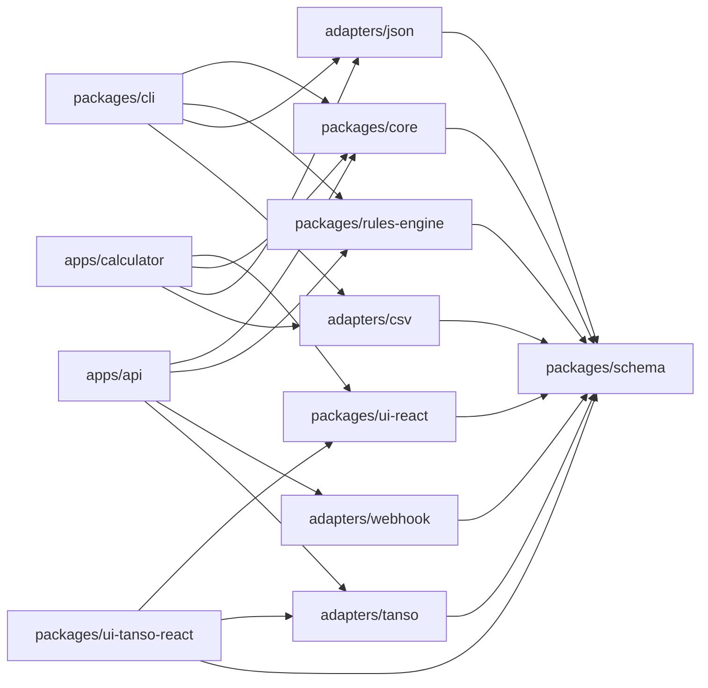
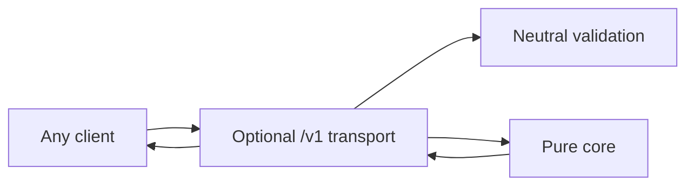
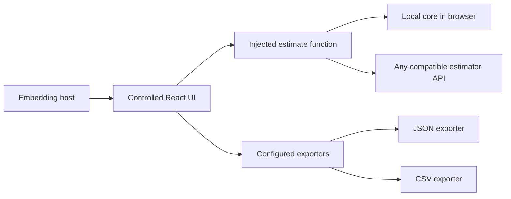
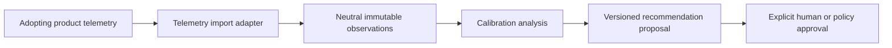
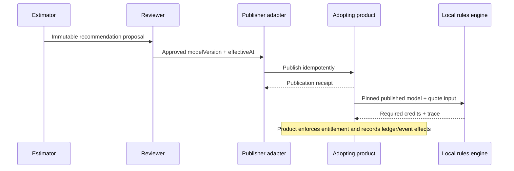

# Credit Estimator Architecture

## Status and intent

This document defines the target architecture and dependency boundaries. It
does not imply that every package or application is implemented in the first
MVP.

The governing decision is
[ADR-001: Provider-neutral core](architecture/decisions/ADR-001-provider-neutral-core.md).
The optional UI boundary is defined by
[ADR-002: Injected React UI](architecture/decisions/ADR-002-injected-react-ui.md).
The calculation formulas remain defined by [methodology.md](methodology.md).

## Architectural principles

1. Tanso is one optional adapter, not the estimator's architecture.
2. Neutral calculations and local quotes are deterministic and side-effect
   free.
3. The core and rules engine require no credentials, persistence, or network.
4. Delivery mechanisms wrap the same contracts; they do not redefine them.
5. Runtime systems can evaluate a published model locally.
6. Stable external keys identify business concepts in portable models.
7. Product-specific data is isolated in namespaced extensions or adapters.
8. Automated recommendations are proposals until explicitly approved and
   assigned an effective timestamp.
9. Adopting products retain all wallet, ledger, entitlement, billing, and
   runtime-event responsibilities.
10. User interfaces receive estimation behavior through dependency injection;
    they do not duplicate formulas or choose a required backend.

## Target repository structure

```text
tanso-oss-credit-estimator/
├── packages/
│   ├── core/
│   ├── schema/
│   ├── rules-engine/
│   ├── cli/
│   ├── ui-react/
│   ├── ui-tanso-react/
│   └── adapters/
│       ├── json/
│       ├── csv/
│       ├── webhook/
│       └── tanso/
├── apps/
│   ├── api/
│   └── calculator/
├── docs/
└── fixtures/
```

The structure is a target. Create packages only when their behavior is needed
and validated; do not build empty framework layers merely to match the tree.

## Package responsibilities

| Package | Owns | Must not own |
|---|---|---|
| `packages/schema` | Versioned neutral inputs, outputs, estimate errors, published models, quote contracts, stable-key and extension conventions | Product SDKs, I/O, persistence, calculations |
| `packages/core` | Cost, EVE/value, credit weights, scenarios, plan recommendations, calibration analysis, recommendation proposals, traces | Adapters, HTTP, filesystem, credentials, wallets, ledgers |
| `packages/rules-engine` | Portable local evaluation of an immutable published model and deterministic quote traces | Model authoring, publication, balances, authorization, event persistence |
| `packages/cli` | Command parsing, file I/O, human-readable failures, orchestration of core and codecs | Alternate formulas, product-specific behavior |
| `packages/ui-react` | Controlled, composable, accessible React components for editing neutral inputs and presenting results, warnings, and traces | Formulas, required transport, authentication, persistence, product-specific actions |
| `packages/ui-tanso-react` | Optional React controls for reviewing and publishing an approved model through the headless Tanso adapter | Neutral calculator behavior, calculations, adapter transport, wallets, billing |
| `packages/adapters/json` | Lossless neutral JSON import/export | Business calculations |
| `packages/adapters/csv` | Documented CSV projections and neutral normalization | Hidden defaults or lossy round trips without warnings |
| `packages/adapters/webhook` | Generic outbound publication and telemetry transport | Core policy or product-specific field leakage |
| `packages/adapters/tanso` | Headless stable-key mapping and optional Tanso publication/telemetry translation | React, UI behavior, neutral formulas, required core dependency, wallet duplication |
| `apps/api` | Optional versioned HTTP transport, validation, authentication, rate limiting, adapter orchestration | Runtime authority, a distinct domain model, live-request dependency |
| `apps/calculator` | Hosted demo and reference composition of the React UI with local or remote estimation and export adapters | New formulas, a required production service, generic package policy |

## Dependency direction



Forbidden dependencies:

- `core -> adapters/*`;
- `rules-engine -> adapters/*`;
- `schema -> core`, delivery layers, or adapters;
- `ui-react -> core`, `apps/*`, or `adapters/*`;
- `adapters/tanso -> ui-react`, `ui-tanso-react`, or React;
- a neutral package -> a Tanso SDK or product entity; and
- a live adopting-product request -> `apps/api` for quote availability.

Static dependency checks should eventually enforce these rules.

## Neutral model identity

Every estimator input and result, quote input and result, exported model, and
publication request contains:

- `schemaVersion`: contract shape and compatibility;
- `methodologyVersion`: formula and rounding semantics; and
- `modelVersion`: immutable commercial assumptions and rules.

A draft estimate uses a caller-assigned `modelVersion` as a revision label.
That version does not imply approval, publication, or an effective date. A
caller must assign a new `modelVersion` before calculating any payload whose
calculation-relevant input differs from a payload previously calculated under
that version.

The stateless core validates that versions are present and echoes them; it
cannot detect historical version reuse. Delivery layers and model registries
enforce the no-reuse invariant when they retain history. Caches must key on the
canonical complete input or a deterministic digest, never on `modelVersion`
alone. Published versions remain immutable and cannot be repointed to a new
payload. The first MVP does not cache estimates; caching remains disabled until
canonical serialization or digest semantics are specified and tested.

Neutral identity fields use stable keys:

- `metricKey` for a billable action;
- `planKey` for a commercial package;
- `productKey` for a product or product surface; and
- `segmentKey` for a customer/workload cohort.

Portable schemas do not require product UUIDs. Adapters resolve keys to local
identifiers.

## Namespaced extensions

Portable objects may include:

```json
{
  "extensions": {
    "com.example.product": {
      "localReference": "value"
    },
    "com.tanso": {
      "creditModelRef": "adapter-managed-reference"
    }
  }
}
```

Rules for extensions:

- namespaces should use a reverse-domain or similarly collision-resistant
  name;
- unknown extensions are preserved when a format supports round trips;
- the neutral core does not branch on an unknown extension;
- secrets and credentials are never embedded;
- product UUIDs may appear only as optional adapter metadata, never as neutral
  identity; and
- a field that changes neutral arithmetic must graduate into a versioned
  neutral schema.

## Neutral calculation input variants

The schema supports direct values for teams that already know their economics
and decomposed values for teams that need the estimator to derive them. A
metric chooses exactly one member of each pair:

- `unitCost` or `unitCostComponents`;
- `confidenceAdjustedValue` or `valueInputs`; and
- `monthlyVolume` or `workloadDrivers`.

Providing both members of a pair or neither member is a validation error. A
selected decomposed object requires every component, including explicit zero
values; validation never substitutes missing financial inputs.

When `scenarios` is omitted, the direct metric inputs form one implicit
`base` scenario with identity multipliers of one. This is a structural
identity rule, not a financial default: all cost, value, and volume inputs are
still required. Supplying a `scenarios` array requires explicit low, base, and
high entries and all three multipliers for each entry.

Conceptual decomposed input:

```json
{
  "metricKey": "agent.example",
  "unitCostComponents": {
    "provider": {
      "inputTokens": 10000,
      "outputTokens": 5000,
      "inputRatePerMillion": 1,
      "outputRatePerMillion": 4
    },
    "infrastructureCost": 0.005,
    "thirdPartyApiCost": 0.003,
    "otherVariableCost": 0.002
  },
  "valueInputs": {
    "estimatedValuePerAction": 4,
    "evidenceConfidence": 0.5
  },
  "workloadDrivers": {
    "accounts": 10,
    "seatsPerAccount": 5,
    "activeSeatPercentage": 0.8,
    "actionsPerActiveSeatPerActiveDay": 2,
    "activeDaysPerMonth": 20,
    "adoptionPercentage": 0.5,
    "completionPercentage": 0.9
  }
}
```

Scenario inputs explicitly include `volumeMultiplier`, `costMultiplier`, and
`providerPriceMultiplier`. For decomposed costs, the provider portion is
multiplied by both cost and provider-price multipliers; non-provider variable
costs are multiplied by the cost multiplier. A metric using direct `unitCost`
requires `providerPriceMultiplier` to equal one because its provider portion
is not separately known.

`planAllocationBuffer` is a required global assumption. A plan recommendation
identifies its `planKey` and may supply an explicit
`allocationRoundingIncrement`; omitting that optional rounding field leaves
the unrounded methodology result unchanged.

Every recommended metric includes a structured `calculationTrace` with source
input paths and ordered calculation steps. Each step has a stable `key`, a
human-readable formula, named operands, and its result. Trace data explains
arithmetic but is never re-evaluated as executable code.

## Deterministic quote contract

The rules engine evaluates a published model locally:

    metricKey + quantity + context + modelVersion -> required credits

Conceptual input:

```json
{
  "schemaVersion": "1.0",
  "methodologyVersion": "1.0",
  "modelVersion": "2026-07-20.1",
  "metricKey": "agent.deep_research",
  "quantity": 3,
  "context": {
    "productKey": "assistant",
    "planKey": "pro",
    "segmentKey": "mid_market",
    "extensions": {}
  }
}
```

Conceptual output:

```json
{
  "schemaVersion": "1.0",
  "methodologyVersion": "1.0",
  "modelVersion": "2026-07-20.1",
  "metricKey": "agent.deep_research",
  "quantity": 3,
  "creditsPerUnit": 20,
  "requiredCredits": 60,
  "appliedRuleKey": "agent.deep_research.default",
  "warnings": [],
  "calculationTrace": {
    "formula": "quantity * creditsPerUnit",
    "operands": [3, 20],
    "result": 60
  }
}
```

The quote operation does not:

- select a model based on the current clock;
- call the estimator API;
- read a wallet or subscription;
- authorize the underlying action;
- deduct, reserve, or grant credits; or
- persist an event or transaction.

The adopting runtime selects the already-published effective model, supplies
its immutable `modelVersion`, evaluates the quote locally, and applies its own
authorization and accounting behavior.

## Embeddable React UI

`packages/ui-react` is an optional presentation package, not a calculation or
transport layer. It supports three composition modes through the same public
contract:

1. a browser host injects the pure core estimator for offline execution;
2. a host injects a function that calls any compatible hosted estimator API;
   or
3. Tanso or another product embeds the controlled components and injects its
   own orchestration.

The conceptual boundary is deliberately small:

```ts
import { z } from "zod";

export type Estimate = (
  input: EstimatorInput,
  context: { signal: AbortSignal },
) => EstimatorResult | Promise<EstimatorResult>;

export const EstimateErrorCodeSchema = z.enum([
  "VALIDATION_ERROR",
  "ESTIMATOR_UNAVAILABLE",
  "ESTIMATION_FAILED",
  "ABORTED",
]);

export const EstimateErrorIssueSchema = z.object({
  path: z.array(z.union([z.string(), z.number().int().nonnegative()])),
  code: z.string().min(1),
  message: z.string().min(1),
}).strict();

export const EstimateErrorSchema = z.object({
  code: EstimateErrorCodeSchema,
  message: z.string().min(1),
  retryable: z.boolean(),
  issues: z.array(EstimateErrorIssueSchema).optional(),
}).strict();

export type EstimateErrorCode = z.infer<typeof EstimateErrorCodeSchema>;
export type EstimateError = z.infer<typeof EstimateErrorSchema>;

export function normalizeEstimateError(
  value: unknown,
  context: { signal: AbortSignal },
): EstimateError {
  if (context.signal.aborted) {
    return { code: "ABORTED", message: "Estimation aborted", retryable: false };
  }

  const parsed = EstimateErrorSchema.safeParse(value);
  if (parsed.success) return parsed.data;

  return {
    code: "ESTIMATION_FAILED",
    message: "Estimation failed",
    retryable: false,
  };
}

export interface ExportRequest {
  format: string;
  input: EstimatorInput;
  result?: EstimatorResult;
}

export interface Exporter {
  readonly format: string;
  readonly label: string;
  export(request: ExportRequest): void | Promise<void>;
}

export type CreditCalculatorMessageKey =
  | "actions.calculate"
  | "actions.calculating"
  | "actions.retry"
  | "actions.reset"
  | "actions.addMetric"
  | "actions.removeMetric"
  | "actions.addScenario"
  | "actions.removeScenario"
  | "actions.addPlan"
  | "actions.removePlan"
  | "actions.showTrace"
  | "actions.hideTrace"
  | "actions.export"
  | "sections.assumptions"
  | "sections.metrics"
  | "sections.scenarios"
  | "sections.plans"
  | "sections.results"
  | "sections.warnings"
  | "sections.calculationTrace"
  | "fields.schemaVersion"
  | "fields.methodologyVersion"
  | "fields.modelVersion"
  | "fields.currency"
  | "fields.realizedPricePerCredit"
  | "fields.targetGrossMargin"
  | "fields.targetValueCapture"
  | "fields.maximumValueCapture"
  | "fields.creditIncrement"
  | "fields.planAllocationBuffer"
  | "fields.metricKey"
  | "fields.planKey"
  | "fields.scenarioKey"
  | "fields.costInputMode"
  | "fields.valueInputMode"
  | "fields.workloadInputMode"
  | "fields.monthlyVolume"
  | "fields.unitCost"
  | "fields.confidenceAdjustedValue"
  | "fields.creditsPerUnitOverride"
  | "fields.inputTokens"
  | "fields.outputTokens"
  | "fields.inputRatePerMillion"
  | "fields.outputRatePerMillion"
  | "fields.infrastructureCost"
  | "fields.thirdPartyApiCost"
  | "fields.otherVariableCost"
  | "fields.estimatedValuePerAction"
  | "fields.evidenceConfidence"
  | "fields.accounts"
  | "fields.seatsPerAccount"
  | "fields.activeSeatPercentage"
  | "fields.actionsPerActiveSeatPerActiveDay"
  | "fields.activeDaysPerMonth"
  | "fields.adoptionPercentage"
  | "fields.completionPercentage"
  | "fields.volumeMultiplier"
  | "fields.costMultiplier"
  | "fields.providerPriceMultiplier"
  | "fields.allocationRoundingIncrement"
  | "help.realizedPricePerCredit"
  | "help.modelVersion"
  | "help.targetGrossMargin"
  | "help.targetValueCapture"
  | "help.maximumValueCapture"
  | "help.unitCost"
  | "help.evidenceConfidence"
  | "help.planAllocationBuffer"
  | "help.scenarioMultipliers"
  | "results.costFloorCredits"
  | "results.valueSupportedCredits"
  | "results.maximumValueCredits"
  | "results.recommendedCreditsPerUnit"
  | "results.providerUnitCost"
  | "results.totalUnitCost"
  | "results.confidenceAdjustedValue"
  | "results.forecastMonthlyVolume"
  | "results.expectedUnitRevenue"
  | "results.expectedUnitGrossMargin"
  | "results.monthlyCredits"
  | "results.monthlyCost"
  | "results.consumptionRevenue"
  | "results.grossProfit"
  | "results.grossMargin"
  | "results.baseMonthlyCredits"
  | "results.bufferedMonthlyCredits"
  | "results.recommendedMonthlyCredits"
  | "results.baseUtilization"
  | "results.highUtilization"
  | "results.expectedUnusedCredits"
  | "results.highScenarioShortfallCredits"
  | "status.resultOutdated"
  | "status.noResults"
  | "status.exporting"
  | "status.exportSucceeded"
  | "status.feasible"
  | "status.economicallyInfeasible"
  | "errors.validation"
  | "errors.unavailable"
  | "errors.failed"
  | "errors.exportFailed";

export type CreditCalculatorMessages = Readonly<
  Record<CreditCalculatorMessageKey, string>
>;

export type CreditCalculatorMessageOverrides =
  Partial<CreditCalculatorMessages>;

export interface CreditCalculatorProps {
  value: EstimatorInput;
  onChange(nextValue: EstimatorInput): void;
  onReset?(): void;
  estimate: Estimate;
  exporters?: readonly Exporter[];
  messages?: CreditCalculatorMessageOverrides;
}
```

Inputs, results, error schemas, and error types are exported by
`packages/schema`. The `Estimate`, exporter, message, props, and error
normalizer contracts are exported by `packages/ui-react`; the combined code
above is conceptual rather than one physical source file.
Supporting both synchronous and asynchronous estimators lets a host choose
local core execution or remote transport without a mode flag in the generic
UI.

An estimator throws synchronously or rejects asynchronously. The UI passes
every rejection through `normalizeEstimateError`; TypeScript annotations on a
throw are never trusted at runtime. A host should map transport,
authentication, rate-limit, and provider failures into `EstimateError`, but an
invalid or arbitrary rejection still becomes a non-retryable
`ESTIMATION_FAILED` error without exposing a stack or secret. Cancellation is
detected from the supplied signal rather than a platform-specific exception.
`ABORTED` is control flow and is not announced as a user-facing failure when
the component initiated the cancellation.

Estimation occurs only when the user explicitly submits **Calculate**. The
controlled `value` is immutable: every edit supplies a new object and mutation
in place is unsupported. Editing updates controlled state, marks an existing
result as outdated, aborts an in-flight calculation, and invalidates its
sequence without calling `estimate`.

Each submission increments a monotonically increasing request sequence,
captures the immutable input reference and estimator function, and passes a
new controller's signal. A completion is accepted only when its sequence,
input reference, and estimator reference remain current. A change to `value`
or `estimate`, an explicit reset, or component unmount aborts and invalidates
the active request. When `onReset` is supplied, the calculator renders its
reset action; activation first clears transient result/error state and
invalidates work, then invokes the host callback. No reset action is rendered
without that capability. Sequence rejection remains required even when the
estimator honors cancellation because a remote computation may still finish.

The package should offer both a convenient assembled component and composable
controlled parts:

```tsx
<CreditCalculator.Root
  value={calculatorInput}
  onChange={setCalculatorInput}
  estimate={estimate}
  exporters={[jsonExporter, csvExporter]}
  messages={messages}
>
  <CreditCalculator.Assumptions />
  <CreditCalculator.Metrics />
  <CreditCalculator.Scenarios />
  <CreditCalculator.Results />
  <CreditCalculator.Warnings />
</CreditCalculator.Root>
```

The first UI version presents economic assumptions, workload metrics,
low/base/high scenarios, recommended weights, cost-floor and value-supported
ranges, infeasibility warnings, calculation traces, and JSON/CSV export
actions. The calculator renders only the supplied exporters. Each exporter
receives the current neutral input and, when available, its corresponding
result; format adapters own serialization and mapping warnings. No exporter
controls are rendered when the list is absent or empty.
Exporter `format` values are stable, case-sensitive capability keys and must
be unique within one calculator. Duplicate keys are invalid configuration and
must be surfaced rather than silently collapsed.

### UI boundaries

- The UI never implements or approximates pricing formulas. It renders the
  injected estimator's versioned result and trace.
- The core entry point used for browser-local estimation has no Node-only
  runtime dependency and requires no polyfills.
- It ships no required API client and owns no credentials, authentication,
  persistence, Stripe behavior, wallet state, or entitlements.
- Tanso actions such as publishing weights live in
  `packages/ui-tanso-react`. The headless `packages/adapters/tanso` package
  imports no React or UI code. Removing both leaves the generic calculator
  fully functional.
- The reference `apps/calculator` may demonstrate local and remote adapters,
  but it is not a required production dependency.
- Default copy uses provider-neutral terms. Product branding and terminology
  are supplied by the embedding host.

### UI quality contract

- Public components are controlled and composable; hosts own durable state.
- The published package is `@tansohq/credit-calculator-react`, with React peer
  support limited to versions exercised in CI, initially
  `^18.2.0 || ^19.0.0`.
- Stable semantic CSS custom properties use the `--credit-calculator-*`
  prefix. Class names use the `credit-calculator-*` prefix, selectors have low
  specificity, and the package supplies no global reset or utility-framework
  assumption.
- Importing the package during SSR does not access `window` or `document` at
  module scope. Browser-only behavior is guarded and begins in effects or
  event handlers.
- A typed `messages` contract supplies neutral English defaults for all
  generic labels, help, status, and error text and allows host overrides.
  The shipped default catalog must satisfy the complete
  `CreditCalculatorMessageKey` union, so adding user-visible generic copy
  requires an explicit contract update. Exporter labels are supplied by the
  host and may already be localized.
- Forms use semantic labels and field-level errors, all workflows are keyboard
  operable, focus moves predictably after validation failures, and status or
  warning meaning is not conveyed by color alone.
- Asynchronous status and result changes use appropriate live-region behavior
  without repeatedly interrupting assistive technology.
- Layouts work from narrow embedding containers through desktop widths; they
  respond to available component space where practical, not only viewport
  size.
- A Web Component is not part of the first UI release. Reconsider it only
  after at least two committed non-React adopters cannot reasonably use the
  React package.
- Future tests cover controlled-state behavior, local/remote result parity,
  explicit-submit behavior, cancellation, sequence-based stale-response
  rejection after resubmission, editing, input replacement, estimator
  replacement, reset, or unmount, runtime error normalization, exporter
  discovery, SSR-safe import, localization,
  accessibility, responsive layouts, and the golden scenario presentation
  path.

Implementation starts only after the deterministic core passes the golden
fixtures. `apps/calculator` then proves that local and hosted estimators are
interchangeable without duplicating methodology.

## Data flows

### 1. Offline estimation and file exchange


The CLI is an orchestrator around this flow. A format adapter may report
mapping warnings but must not change formulas.

### 2. Generic hosted API



The hosted API is convenient, not authoritative. It uses the same versions
and payloads as the library and CLI. Future HTTP design should use versioned
resource-oriented routes, consistent validation errors, and an OpenAPI
contract. It must not introduce calculations that are absent from the core.
Its client maps structured transport failures to the neutral `EstimateError`
contract. Request identifiers and HTTP metadata remain outside deterministic
calculation results.

Candidate transport operations, not yet implemented:

- `POST /v1/estimates` to calculate a recommendation;
- `POST /v1/quotes` for testing or non-critical convenience; and
- `POST /v1/publications` to initiate an explicitly approved adapter flow.

Production request paths still evaluate published models locally.

### 3. Embeddable calculator



Only one estimator implementation is injected for a mounted calculator. The
UI has no direct dependency on either branch. The embedding host owns any
remote authentication, storage, retry policy, and product-specific controls.
Editing does not traverse either estimation branch; only explicit submission
does. The UI passes an abort signal and independently rejects stale results by
request sequence.

### 4. Calibration and recommendation proposal



The core receives a snapshot; it does not fetch live telemetry. A proposal is
not a production rule.

### 5. Publication and runtime use



The publication adapter may be unavailable without affecting already
published local quote evaluation.

## Adapter contracts

These interfaces are conceptual TypeScript contracts. They define ownership
and side effects; they are not application code.

### Model export and import

```ts
interface ModelExportAdapter {
  readonly format: string;
  exportModel(model: PortableCreditModel): ExportArtifact;
}

interface ModelImportAdapter {
  readonly format: string;
  importModel(source: ImportArtifact): ImportResult<PortableCreditModel>;
}
```

Requirements:

- JSON export is lossless and canonicalizable.
- CSV export documents its table layout and any unsupported nested fields.
- Imports return validation and mapping warnings; they never invent missing
  financial values.
- Round trips preserve required versions, stable keys, traces, and supported
  extensions.

### Telemetry import

```ts
interface TelemetryImportAdapter {
  importTelemetry(request: TelemetryImportRequest):
    Promise<TelemetrySnapshot>;
}
```

Requirements:

- adapters normalize product events into versioned neutral observations;
- snapshots include source identity and an explicit observation window;
- metric, product, plan, and segment references use stable keys after mapping;
- the core receives a complete immutable snapshot and performs no fetch; and
- missing, duplicate, or unmapped records are surfaced explicitly.

### Cost catalog provider

```ts
interface CostCatalogProvider {
  getCatalog(request: CostCatalogRequest): Promise<CostCatalogSnapshot>;
}
```

Requirements:

- the provider resolves external prices outside the deterministic calculation;
- the snapshot includes currency, unit basis, source, and `asOf` supplied by
  the provider;
- the core treats the snapshot as explicit input;
- cached or offline catalogs are valid implementations; and
- a calculation never changes because a live catalog changed mid-run.

### Runtime model publication

```ts
interface RuntimeModelPublisher {
  publish(request: ApprovedPublicationRequest):
    Promise<PublicationReceipt>;
}
```

`ApprovedPublicationRequest` includes the immutable model, approval evidence,
explicit `effectiveAt`, target adapter key, and idempotency key.

Requirements:

- reject requests without approval or `effectiveAt`;
- do not mutate weights during translation;
- report unsupported rules before activation;
- support idempotent retries;
- return product-specific identifiers only in a namespaced extension; and
- leave runtime activation, rollback, wallets, and transactions with the
  adopting product.

## Adapter composition

The core does not discover or call adapters. A delivery layer composes them:

- the CLI chooses JSON or CSV codecs from command options;
- the API app selects configured telemetry, catalog, or publisher adapters;
- the calculator app injects local core execution or a hosted API function
  into the UI and supplies JSON/CSV exporters;
- offline library consumers pass already-normalized objects directly; and
- adopting products embed the rules engine with a pinned published model.

This inversion keeps optional products at the edge.

## JSON and CSV portability

JSON is the canonical interchange format because it can preserve nested
traces, versions, rules, warnings, and extensions.

CSV is a documented projection for tabular inputs and outputs. A multi-table
model may use a manifest plus separate files for assumptions, metrics,
scenarios, plans, and rules. CSV import/export must declare:

- delimiter, encoding, decimal separator, and header version;
- table and foreign-key conventions;
- how extensions and traces are represented or omitted; and
- whether a round trip is lossless.

Lossy CSV export must emit a warning and must never be the only stored form of
an approved published model.

## Publication safety

A recommendation passes through explicit states:

    DRAFT -> PROPOSED -> APPROVED -> PUBLISHED -> EFFECTIVE

- Calculation may produce `DRAFT` or `PROPOSED` artifacts only.
- Approval identifies an immutable `modelVersion`.
- Publication requires approval evidence and explicit `effectiveAt`.
- Adapters publish idempotently and return receipts.
- Adopting products own activation and rollback.
- Recalibration creates a new proposal and model version; it does not edit the
  effective model in place.

## Security and reliability boundaries

- Neutral packages contain no credentials or network clients.
- Delivery layers validate untrusted input before invoking the core.
- Adapters own secret access, authentication, retry, timeout, and rate-limit
  behavior.
- Publication adapters should use least-privilege credentials and idempotency.
- Published models should be immutable and verifiable; signing policy remains
  an open decision.
- Runtime quote evaluation must continue during estimator API or publication
  adapter outages.

## Architecture acceptance checks

- Removing `packages/adapters/tanso` does not break schema, core, rules engine,
  JSON/CSV workflows, CLI, generic API behavior, or the generic React UI.
- Core dependency manifests contain no adapter or product SDK.
- The React UI can render and estimate with a test function and no network,
  credentials, API app, or product adapter.
- Browser-local estimation loads the pure core without Node.js polyfills.
- The UI calls the estimator only on explicit submission, passes an
  `AbortSignal`, and rejects every completion whose request sequence is stale.
- Input replacement, estimator replacement, reset, and unmount abort and
  invalidate active estimation. Arbitrary rejection values normalize through
  `EstimateErrorSchema` without exposing internal details.
- The UI renders exactly the configured exporters and none when no exporters
  are supplied.
- `packages/adapters/tanso` imports no React; optional Tanso controls exist
  only in `packages/ui-tanso-react`.
- Package import is SSR-safe, and all default CSS selectors and public custom
  properties use the documented prefix.
- Golden fixtures contain no required product-specific identifier.
- Golden fixtures cover decomposed cost, confidence adjustment, driver-based
  volume, plan allocation, and structured traces as well as direct inputs.
- The same published model and quote input produce identical output offline,
  through the CLI, and through the API wrapper.
- Every result contains all three versions.
- Delivery and publication tests reject reuse of one `modelVersion` for two
  different calculation-relevant payloads; caches include the canonical input
  or its deterministic digest.
- No live quote requires credentials or network access.
- Publication rejects missing approval or effective timestamp.
- Automated recommendations cannot activate themselves.
- Local and hosted estimator functions produce the same UI result for the
  same versioned input, and no component duplicates calculation formulas.

## Open questions

1. Which portable execution targets, if any, are required beyond Node.js and
   modern browsers?
2. Should published models be cryptographically signed, and by whom?
3. How should model rollback and overlapping effective windows be represented?
4. Which context fields may select a rule without making behavior opaque?
5. What CSV layout provides the best balance between usability and lossless
   round trips?
6. Should cost catalog snapshots be embedded in model inputs or referenced by
   content hash?
7. What approval evidence is portable across adopting products?
8. What decimal precision and tie-breaking rules apply to
   `round_to_increment` and non-exact plan-allocation rounding?
